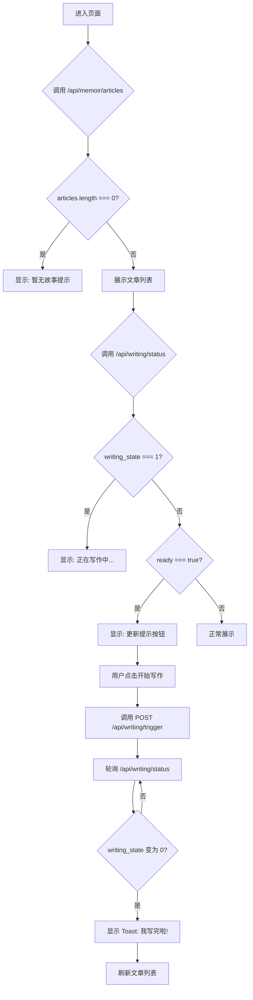
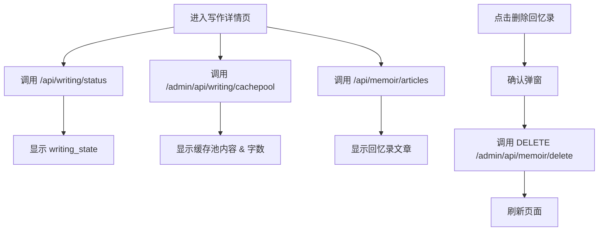

# 写作功能 API 接口文档

## 📱 小程序端 API

### 1. 获取写作状态

**接口**: `GET /api/writing/status`

**描述**: 获取用户的写作状态，包括缓存池字数、是否可以触发写作、是否首次写作等信息。

**请求参数**:
| 参数名 | 类型 | 必填 | 说明 |
|--------|------|------|------|
| user_id | string | 是 | 用户 ID (query parameter) |

**响应示例**:
```json
{
  "code": 0,
  "message": "success",
  "data": {
    "ready": true,                  // 是否可以写作
    "is_first_time": false,         // 是否首次写作
    "words_count": 650,             // 当前缓存池字数
    "threshold": 500,               // 触发阈值
    "writing_state": 0              // 0=pending, 1=writing
  }
}
```

**前端使用场景**:
- `writing_state === 1` → 显示"正在写作中…"
- `ready === true && words_count > threshold` → 显示"更新提示"按钮
- `is_first_time === true && words_count > 0` → 首次写作（字数>0即可触发）

---

### 2. 触发写作任务

**接口**: `POST /api/writing/trigger`

**描述**: 触发 Wtr Agent 开始写作，将缓存池中的 topic 转化为回忆录文章。

**请求参数**:
| 参数名 | 类型 | 必填 | 说明 |
|--------|------|------|------|
| user_id | string | 是 | 用户 ID (query parameter) |

**响应示例**:
```json
{
  "code": 0,
  "message": "success",
  "data": {
    "success": true,
    "message": "写作完成，共生成 3 篇文章",
    "articles_created": 3
  }
}
```

**错误响应示例**:
```json
{
  "code": 0,
  "message": "success",
  "data": {
    "success": false,
    "message": "写作失败",
    "articles_created": 0,
    "error": "LLM parsing failed after 3 attempts"
  }
}
```

**前端使用场景**:
- 用户点击"开始写作"按钮时调用
- 调用后立即轮询 `/api/writing/status` 检查 `writing_state`
- 当 `writing_state` 从 1 变为 0 时，显示 Toast "我写完啦！更新中…"，然后刷新文章列表

---

### 3. 获取回忆录章节列表

**接口**: `GET /api/memoir/chapters`

**描述**: 获取用户的所有回忆录章节（不含文章内容）。

**请求参数**:
| 参数名 | 类型 | 必填 | 说明 |
|--------|------|------|------|
| user_id | string | 是 | 用户 ID (query parameter) |

**响应示例**:
```json
{
  "code": 0,
  "message": "success",
  "data": {
    "chapters": [
      {
        "chapter_id": 1,
        "link_stage_id": 5,
        "chapter_name": "童年时光",
        "chapter_sort_num": 1,
        "created_time": "2026-02-10T15:30:00"
      },
      {
        "chapter_id": 2,
        "link_stage_id": 6,
        "chapter_name": "求学之路",
        "chapter_sort_num": 2,
        "created_time": "2026-02-10T16:00:00"
      }
    ]
  }
}
```

**前端使用场景**:
- 可用于章节导航、目录展示等

---

### 4. 获取回忆录文章列表

**接口**: `GET /api/memoir/articles`

**描述**: 获取用户的所有回忆录文章，包含章节名、小节名、内容等。

**请求参数**:
| 参数名 | 类型 | 必填 | 说明 |
|--------|------|------|------|
| user_id | string | 是 | 用户 ID (query parameter) |
| chapter_id | integer | 否 | 章节 ID，不传则返回所有文章 |

**响应示例（全部文章）**:
```json
{
  "code": 0,
  "message": "success",
  "data": {
    "articles": [
      {
        "section_id": 1,
        "topic_id": 10,
        "chapter_id": 1,
        "chapter_name": "童年时光",
        "section_name": "外婆家的院子",
        "section_content": "在外婆家的院子里，有一只大黄狗...",
        "section_sort_num": 1,
        "created_time": "2026-02-10T15:30:00"
      },
      {
        "section_id": 2,
        "topic_id": 11,
        "chapter_id": 1,
        "chapter_name": "童年时光",
        "section_name": "小学的操场",
        "section_content": "小学的操场上，我们经常踢足球...",
        "section_sort_num": 2,
        "created_time": "2026-02-10T15:35:00"
      }
    ]
  }
}
```

**响应示例（按章节筛选）**:
```json
{
  "code": 0,
  "message": "success",
  "data": {
    "articles": [
      {
        "section_id": 1,
        "topic_id": 10,
        "chapter_id": 1,
        "section_name": "外婆家的院子",
        "section_content": "在外婆家的院子里，有一只大黄狗...",
        "section_sort_num": 1,
        "created_time": "2026-02-10T15:30:00"
      }
    ]
  }
}
```

**前端使用场景**:
- 页面初始化时调用，判断 `articles.length === 0` 显示"暂无故事"
- 按 `chapter_sort_num` 和 `section_sort_num` 排序展示
- 可按 `section_content` 字数进行分页（前端自行处理）

**前端分页建议**:
```javascript
// 前端分页逻辑示例
const PAGE_SIZE = 500; // 每页 500 字
let currentPage = 1;
let allArticles = []; // 从 API 获取的所有文章

function paginateArticles(articles, pageSize) {
  let pages = [];
  let currentPageContent = '';
  let currentPageArticles = [];
  
  articles.forEach(article => {
    const content = article.section_content;
    
    if (currentPageContent.length + content.length > pageSize && currentPageContent.length > 0) {
      // 当前页已满，创建新页
      pages.push({
        content: currentPageContent,
        articles: currentPageArticles
      });
      currentPageContent = '';
      currentPageArticles = [];
    }
    
    currentPageContent += `【${article.chapter_name}】${article.section_name}\n${content}\n\n`;
    currentPageArticles.push(article);
  });
  
  // 添加最后一页
  if (currentPageContent.length > 0) {
    pages.push({
      content: currentPageContent,
      articles: currentPageArticles
    });
  }
  
  return pages;
}
```

---

## 🔧 管理后台 API

### 5. 获取写作缓存池内容

**接口**: `GET /admin/api/writing/cachepool`

**描述**: 获取指定用户的写作缓存池内容（用于管理后台查看）。

**请求参数**:
| 参数名 | 类型 | 必填 | 说明 |
|--------|------|------|------|
| user_id | string | 是 | 用户 ID (query parameter) |

**响应示例**:
```json
{
  "code": 0,
  "message": "success",
  "data": {
    "cachepool": [
      {
        "topic_id": 15,
        "topic_title": "大学时代的社团活动",
        "topic_content": "我在大学参加了摄影社...",
        "word_count": 120,
        "created_time": "2026-02-10T14:00:00"
      },
      {
        "topic_id": 18,
        "topic_title": "第一次出国旅行",
        "topic_content": "那是我第一次坐飞机...",
        "word_count": 200,
        "created_time": "2026-02-10T15:00:00"
      }
    ],
    "total_words": 320
  }
}
```

**状态**: ✅ **已实现**

**实现文件**: [backend/admin_service.py:L777-L843](file:///Users/wangyituo/Documents/拓的文稿/项目/回忆录项目/回忆录代码项目/doubao-mini-project/backend/admin_service.py#L777-L843)

---

### 6. 删除用户回忆录

**接口**: `DELETE /admin/api/memoir/delete`

**描述**: 删除指定用户的所有回忆录文章。

**删除范围**:
- `memoir_article` — 回忆录文章
- `memoir_chapter` — 空章节（没有文章的章节）
- 重置 `topic.topic_writing_state` 为 0（已写作完成的 topic）

**不删除**:
- `writing_source_cachepool` — 写作缓存池
- `writing_status` — 写作状态
- `topic` — 话题表（可能用于其他功能）

**请求参数**:
| 参数名 | 类型 | 必填 | 说明 |
|--------|------|------|------|
| user_id | string | 是 | 用户 ID (query parameter) |

**响应示例**:
```json
{
  "code": 0,
  "message": "删除成功",
  "data": {
    "deleted_count": 12,
    "deleted_chapters": 3,
    "reset_topics": 12
  }
}
```

**状态**: ✅ **已实现**

**实现文件**: [backend/admin_service.py:L846-L919](file:///Users/wangyituo/Documents/拓的文稿/项目/回忆录项目/回忆录代码项目/doubao-mini-project/backend/admin_service.py#L846-L919)

---

### 7. Wtr LLM 提示词配置

**现有接口**: 管理后台已有提示词管理功能

**接口**: `GET /admin/api/config/prompts?llm_type=3`

**数据库**: `prompt_config` 表中 `llm_type = 3` 的记录

**前端展示**:
- 在"配置管理 → 提示词"页面，应该已经能自动识别并展示 Wtr LLM 的提示词
- 如果没有显示，需要检查前端代码中是否硬编码了 `llm_type` 的筛选条件

**llm_type 映射**:
- `0` = Intv (访谈员)
- `1` = Stn (故事板)
- `2` = Dir (导演)
- `3` = Wtr (写作) ← **新增**

**状态**: ✅ **已支持**（数据库已有记录，前端需要确认是否正确展示）

---

## 🔄 前端交互流程

### 小程序"我的故事"页面流程



### 管理后台"写作详情"页面流程



---

## ⚠️ 需要补充的功能

### 1. 新增管理后台 API（2个）

**文件**: `backend/admin_service.py`

需要新增：
- `GET /admin/api/writing/cachepool` — 获取写作缓存池内容
- `DELETE /admin/api/memoir/delete` — 删除用户回忆录

### 2. 前端分页逻辑

**选项 A**: 前端自行处理（推荐）
- 从 `/api/memoir/articles` 获取全部文章
- 前端按字数分页（500字/页）

**选项 B**: 后端提供分页 API
- 新增 `GET /api/memoir/articles/paginated?page=1&page_size=500`
- 后端按字数计算分页

**建议**: 采用选项 A，因为回忆录文章总量不会太大，前端分页更灵活。

---

## ✅ 总结

**现有 API 覆盖情况**:
- ✅ 小程序核心功能：**100% 覆盖**
  - 判断是否有数据 ✅
  - 展示回忆录文章 ✅
  - 判断是否可更新 ✅
  - 触发写作 ✅
  - 判断写作状态 ✅
  - 分页加载（前端自行处理）✅

- ✅ 管理后台功能：**100% 覆盖**
  - 获取写作缓存池内容 ✅
  - 删除用户回忆录 ✅
  - Wtr LLM 提示词配置 ✅

**API 端点总览**:

| 端点 | 方法 | 用途 | 状态 |
|------|------|------|------|
| `/api/writing/status` | GET | 获取写作状态 | ✅ 已实现 |
| `/api/writing/trigger` | POST | 触发写作任务 | ✅ 已实现 |
| `/api/memoir/chapters` | GET | 获取章节列表 | ✅ 已实现 |
| `/api/memoir/articles` | GET | 获取文章列表 | ✅ 已实现 |
| `/admin/api/writing/cachepool` | GET | 获取缓存池内容 | ✅ 已实现 |
| `/admin/api/memoir/delete` | DELETE | 删除用户回忆录 | ✅ 已实现 |
| `/admin/api/config/prompts?llm_type=3` | GET | Wtr 提示词配置 | ✅ 已支持 |

**前端开发建议**:
1. **小程序端**: 所有 API 已就绪，可以直接开始开发
2. **管理后台**: 所有 API 已就绪，可以直接开始开发
3. **分页逻辑**: 建议前端自行处理（500字/页），API 返回全部文章
4. **轮询机制**: 写作任务触发后，建议每 2 秒轮询一次 `/api/writing/status` 检查 `writing_state`

**测试建议**:
- 使用 Postman 或 curl 测试所有 API 端点
- 验证写作缓存池触发逻辑（创建/更新 topic 后检查 `writing_source_cachepool` 表）
- 验证写作流程（触发写作 → 轮询状态 → 获取文章）
- 验证管理后台删除功能（删除回忆录 → 验证数据库）

